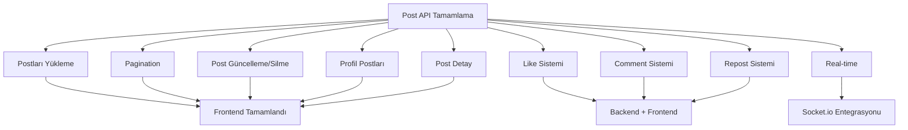

# Post API Tamamlama Planı

## 📋 Özet

Post API endpoint'leri backend'de zaten tamamen implement edilmiş durumda. Ancak frontend tarafında eksik özellikler var. Bu plan, frontend'i backend API'leriyle tam entegre etmek için gerekli adımları içerir.

## ✅ Mevcut Durum

### Backend (Tamamlandı)
- ✅ Post model ([`src/models/Post.js`](../src/models/Post.js:1))
- ✅ Post controller ([`src/controllers/postController.js`](../src/controllers/postController.js:1))
- ✅ Post routes ([`src/routes/posts.js`](../src/routes/posts.js:1))
- ✅ Database schema (posts tablosu)
- ✅ Authentication middleware entegrasyonu

### Frontend (Kısmen Tamamlandı)
- ✅ API client ([`public/js/api.js`](../public/js/api.js:52))
- ✅ Post oluşturma ([`public/js/app.js`](../public/js/app.js:237))
- ✅ Post HTML template ([`public/js/api.js`](../public/js/api.js:129))
- ❌ Postları yükleme
- ❌ Pagination
- ❌ Post güncelleme/silme UI
- ❌ Like, comment, repost özellikleri

## 🎯 Hedefler

1. Postları sayfa yüklendiğinde otomatik yükle
2. Pagination (sayfalama) sistemi ekle
3. Post güncelleme ve silme UI'ı ekle
4. Like, comment, repost özelliklerini ekle
5. Profil sayfasında kullanıcının postlarını göster
6. Post detay sayfası ekle

## 📝 Görev Listesi

### 1. Postları Yükleme (Öncelik: Yüksek)

**Dosya:** [`public/js/app.js`](../public/js/app.js:1)

**Görevler:**
- [ ] `loadPosts()` fonksiyonu oluştur
- [ ] Sayfa yüklendiğinde postları çek
- [ ] Postları `.posts` container'ına ekle
- [ ] Loading state göster
- [ ] Error handling ekle

**Kod Örneği:**
```javascript
async function loadPosts(page = 1, limit = 20) {
  const postsContainer = document.querySelector('.posts');
  
  try {
    const response = await api.posts.getAll(page, limit);
    
    if (response.success) {
      response.data.posts.forEach(post => {
        const postElement = document.createElement('article');
        postElement.className = 'post';
        postElement.innerHTML = createPostHTML(post);
        postsContainer.appendChild(postElement);
      });
    }
  } catch (error) {
    console.error('Post yükleme hatası:', error);
  }
}
```

### 2. Pagination (Öncelik: Yüksek)

**Dosya:** [`public/js/app.js`](../public/js/app.js:1)

**Görevler:**
- [ ] "Daha fazla yükle" butonu ekle
- [ ] Infinite scroll veya manual pagination seç
- [ ] Loading state göster
- [ ] Son sayfa kontrolü

**Kod Örneği:**
```javascript
let currentPage = 1;
let isLoading = false;
let hasMorePosts = true;

async function loadMorePosts() {
  if (isLoading || !hasMorePosts) return;
  
  isLoading = true;
  const loadMoreBtn = document.querySelector('.load-more-btn');
  if (loadMoreBtn) loadMoreBtn.textContent = 'Yükleniyor...';
  
  const response = await api.posts.getAll(currentPage + 1, 20);
  
  if (response.success) {
    currentPage++;
    // Postları ekle...
    
    if (response.data.posts.length < 20) {
      hasMorePosts = false;
      if (loadMoreBtn) loadMoreBtn.style.display = 'none';
    }
  }
  
  isLoading = false;
}
```

### 3. Post Güncelleme UI (Öncelik: Orta)

**Dosya:** [`public/js/app.js`](../public/js/app.js:1)

**Görevlar:**
- [ ] Post düzenleme modal'ı oluştur (HTML)
- [ ] `editPost()` fonksiyonu oluştur
- [ ] Post içeriğini modal'a yükle
- [ ] Güncelleme API çağrısı yap
- [ ] Post'u DOM'da güncelle

**HTML Ekleme:**
```html
<!-- Edit Post Modal -->
<div class="modal" id="edit-post-modal">
  <div class="modal-content">
    <div class="modal-header">
      <h3>Postu Düzenle</h3>
      <button class="modal-close">&times;</button>
    </div>
    <div class="modal-body">
      <textarea class="edit-post-textarea" maxlength="500"></textarea>
      <div class="char-count">0/500</div>
    </div>
    <div class="modal-footer">
      <button class="modal-btn-cancel">İptal</button>
      <button class="modal-btn-save">Kaydet</button>
    </div>
  </div>
</div>
```

### 4. Post Silme UI (Öncelik: Orta)

**Dosya:** [`public/js/app.js`](../public/js/app.js:1)

**Görevler:**
- [ ] Silme butonu ekle (post actions'a)
- [ ] Onay modal'ı oluştur
- [ ] `deletePost()` fonksiyonu oluştur
- [ ] Post'u DOM'dan kaldır

**Kod Örneği:**
```javascript
async function deletePost(postId) {
  if (!confirm('Bu postu silmek istediğinizden emin misiniz?')) return;
  
  try {
    await api.posts.delete(postId);
    
    // Post'u DOM'dan kaldır
    const postElement = document.querySelector(`[data-post-id="${postId}"]`);
    if (postElement) {
      postElement.remove();
    }
  } catch (error) {
    console.error('Post silme hatası:', error);
    alert('Post silinirken bir hata oluştu');
  }
}
```

### 5. Like Sistemi (Öncelik: Orta)

**Backend Ekleme:**
- [ ] Likes tablosu oluştur (database.js)
- [ ] Like model oluştur (src/models/Like.js)
- [ ] Like controller oluştur (src/controllers/likeController.js)
- [ ] Like routes oluştur (src/routes/likes.js)

**Frontend Ekleme:**
- [ ] Like API fonksiyonları ekle (api.js)
- [ ] Like butonu event handler ekle
- [ ] Like sayısını güncelle

**Database Schema:**
```sql
CREATE TABLE IF NOT EXISTS likes (
  id INTEGER PRIMARY KEY AUTOINCREMENT,
  user_id INTEGER NOT NULL,
  post_id INTEGER NOT NULL,
  created_at TIMESTAMP DEFAULT CURRENT_TIMESTAMP,
  FOREIGN KEY (user_id) REFERENCES users(id) ON DELETE CASCADE,
  FOREIGN KEY (post_id) REFERENCES posts(id) ON DELETE CASCADE,
  UNIQUE(user_id, post_id)
)
```

### 6. Comment Sistemi (Öncelik: Orta)

**Backend Ekleme:**
- [ ] Comments tablosu oluştur (database.js)
- [ ] Comment model oluştur (src/models/Comment.js)
- [ ] Comment controller oluştur (src/controllers/commentController.js)
- [ ] Comment routes oluştur (src/routes/comments.js)

**Frontend Ekleme:**
- [ ] Comment API fonksiyonları ekle (api.js)
- [ ] Comment modal'ı oluştur
- [ ] Comment listeleme fonksiyonu
- [ ] Comment gönderme fonksiyonu

**Database Schema:**
```sql
CREATE TABLE IF NOT EXISTS comments (
  id INTEGER PRIMARY KEY AUTOINCREMENT,
  user_id INTEGER NOT NULL,
  post_id INTEGER NOT NULL,
  content TEXT NOT NULL,
  created_at TIMESTAMP DEFAULT CURRENT_TIMESTAMP,
  updated_at TIMESTAMP DEFAULT CURRENT_TIMESTAMP,
  deleted_at TIMESTAMP,
  FOREIGN KEY (user_id) REFERENCES users(id) ON DELETE CASCADE,
  FOREIGN KEY (post_id) REFERENCES posts(id) ON DELETE CASCADE
)
```

### 7. Repost Sistemi (Öncelik: Düşük)

**Backend Ekleme:**
- [ ] Reposts tablosu oluştur (database.js)
- [ ] Repost model oluştur (src/models/Repost.js)
- [ ] Repost controller oluştur (src/controllers/repostController.js)
- [ ] Repost routes oluştur (src/routes/reposts.js)

**Frontend Ekleme:**
- [ ] Repost API fonksiyonları ekle (api.js)
- [ ] Repost butonu event handler ekle
- [ ] Repost sayısını güncelle

**Database Schema:**
```sql
CREATE TABLE IF NOT EXISTS reposts (
  id INTEGER PRIMARY KEY AUTOINCREMENT,
  user_id INTEGER NOT NULL,
  post_id INTEGER NOT NULL,
  created_at TIMESTAMP DEFAULT CURRENT_TIMESTAMP,
  FOREIGN KEY (user_id) REFERENCES users(id) ON DELETE CASCADE,
  FOREIGN KEY (post_id) REFERENCES posts(id) ON DELETE CASCADE,
  UNIQUE(user_id, post_id)
)
```

### 8. Profil Sayfası Postları (Öncelik: Yüksek)

**Dosya:** [`public/js/profile.js`](../public/js/profile.js:1)

**Görevler:**
- [ ] Profil sayfası yüklendiğinde kullanıcının postlarını çek
- [ ] Postları profil sayfasında göster
- [ ] Pagination ekle

**Kod Örneği:**
```javascript
async function loadUserPosts(userId) {
  try {
    const response = await api.posts.getByUserId(userId, 1, 20);
    
    if (response.success) {
      const postsContainer = document.querySelector('.profile-posts');
      postsContainer.innerHTML = '';
      
      response.data.posts.forEach(post => {
        const postElement = document.createElement('article');
        postElement.className = 'post';
        postElement.innerHTML = createPostHTML(post);
        postsContainer.appendChild(postElement);
      });
    }
  } catch (error) {
    console.error('Kullanıcı postları yükleme hatası:', error);
  }
}
```

### 9. Post Detay Sayfası (Öncelik: Düşük)

**Görevler:**
- [ ] Post detay sayfası HTML oluştur
- [ ] Post detayını API'den çek
- [ ] Post'u göster
- [ ] Comment'leri göster
- [ ] Comment gönderme formu ekle

### 10. Real-time Güncellemeler (Öncelik: Düşük)

**Görevler:**
- [ ] Socket.io entegrasyonu
- [ ] Yeni post event'i dinle
- [ ] Post'u otomatik ekle
- [ ] Like/Comment event'leri dinle
- [ ] UI'ı güncelle

## 🔄 İş Akışı



## 📊 Öncelik Sırası

1. **Yüksek Öncelik:**
   - Postları yükleme
   - Pagination
   - Profil sayfası postları

2. **Orta Öncelik:**
   - Post güncelleme/silme UI
   - Like sistemi
   - Comment sistemi

3. **Düşük Öncelik:**
   - Repost sistemi
   - Post detay sayfası
   - Real-time güncellemeler

## 🎨 Tasarım Kuralları

Tüm yeni özellikler CLAUDE.md'deki kurallara uymalı:
- Gruvbox Dark renk paleti kullan
- 3px solid border'lar
- Border-radius kullanma
- Press Start 2P font'u kullan
- 8px grid sistemi
- Mobile-first responsive tasarım

## 🔒 Güvenlik

- Tüm API çağrılarında authentication kontrolü
- XSS koruması (textContent kullan)
- CSRF token kullan (cookie-based auth)
- Rate limiting (zaten mevcut)

## 📝 Notlar

- Backend API'ler zaten hazır, sadece frontend entegrasyonu gerekli
- Like, Comment, Repost için backend endpoint'leri oluşturulmalı
- Real-time özellikler için Socket.io entegrasyonu gerekli
- Tüm değişiklikler CLAUDE.md kurallarına uygun olmalı
